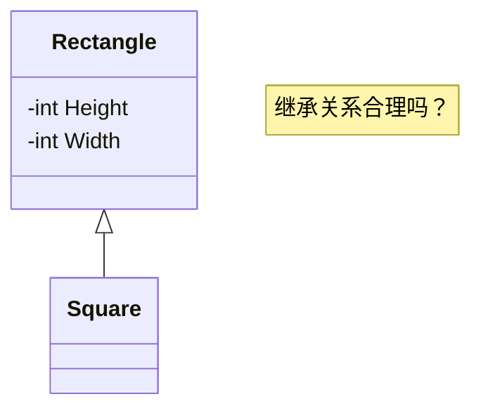
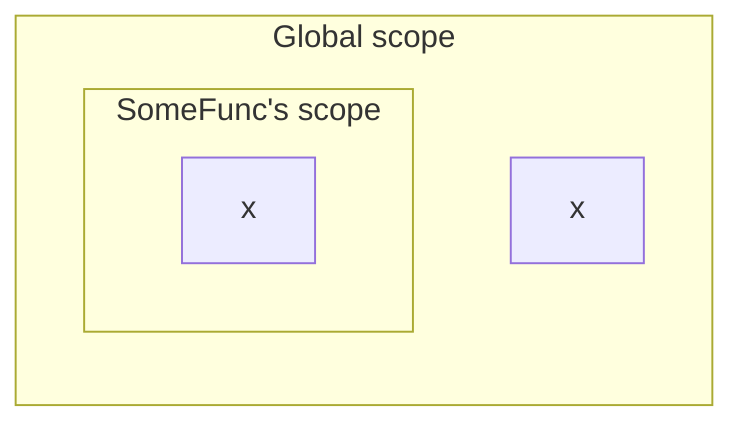
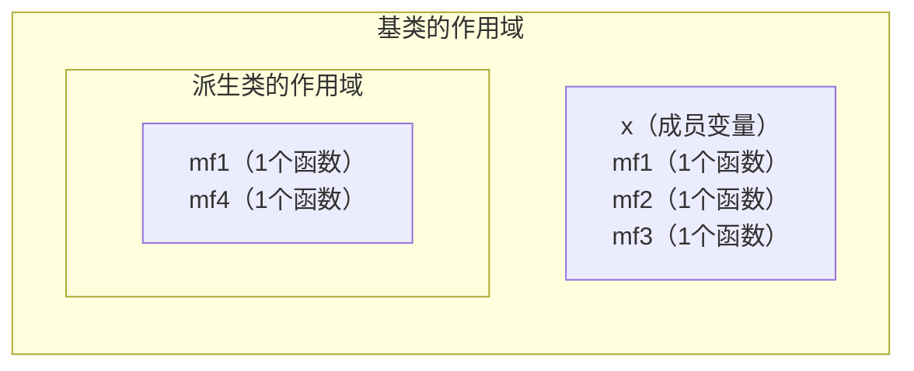
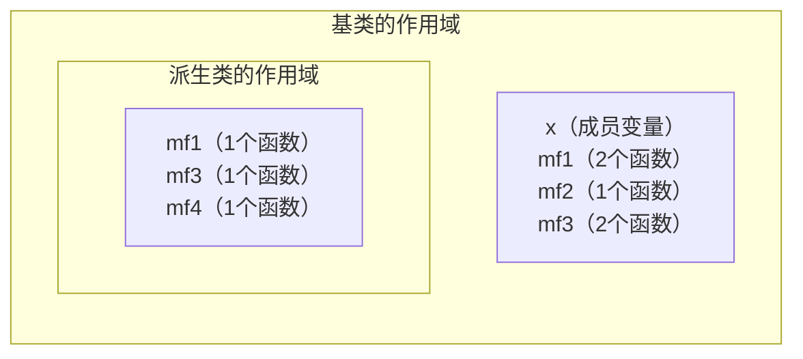
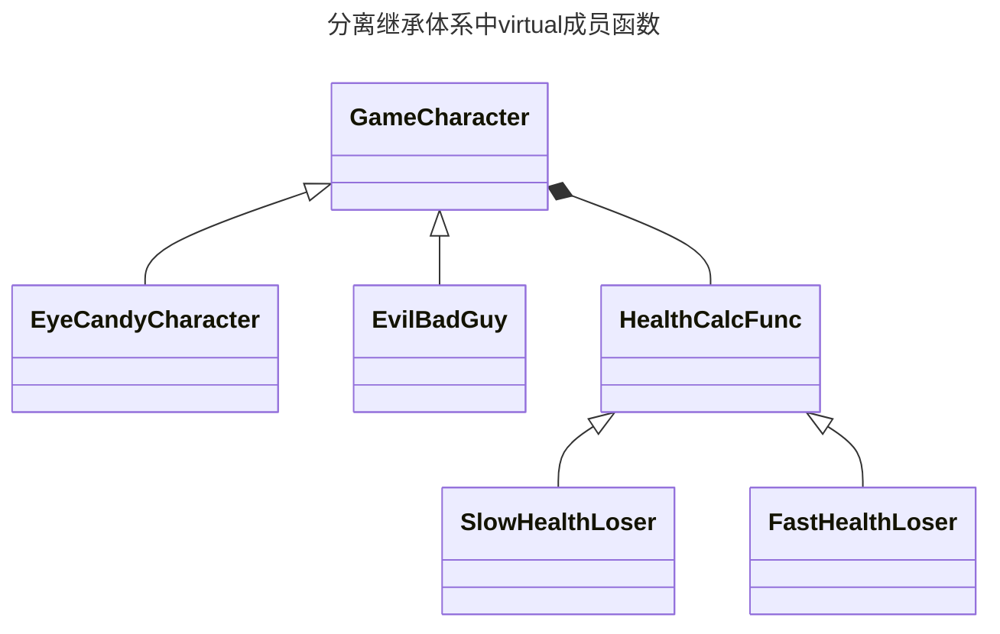
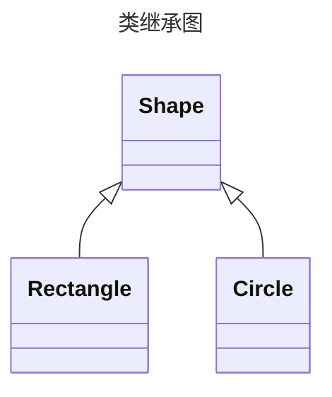
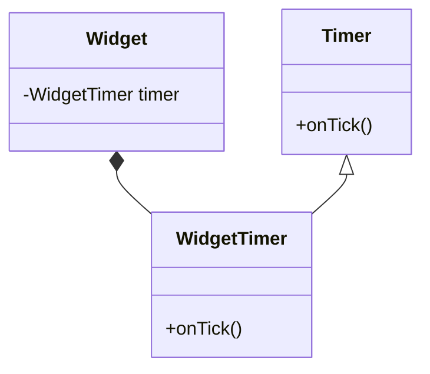
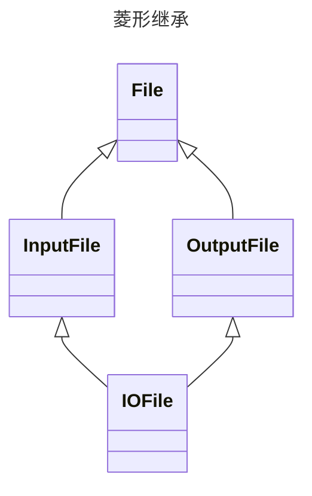
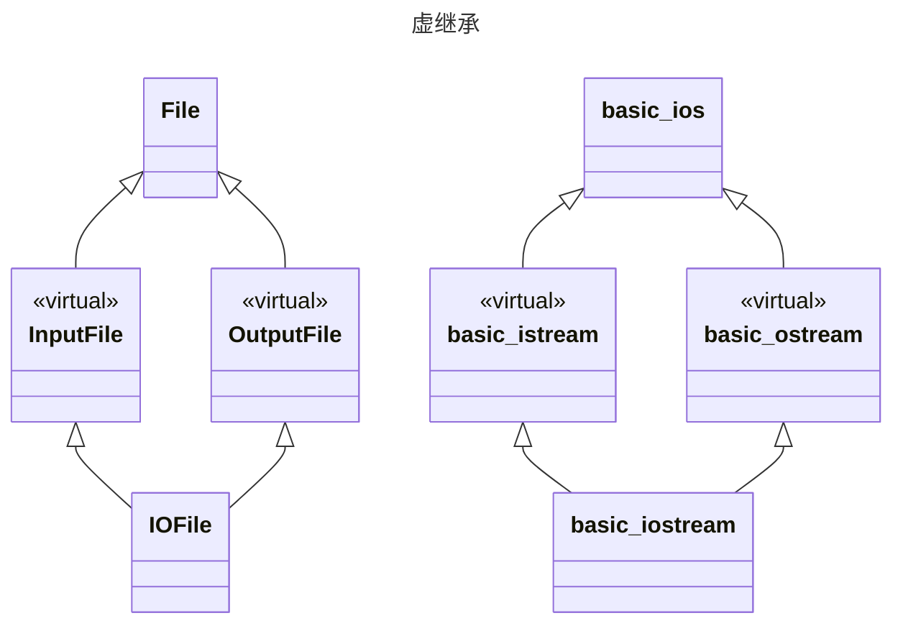
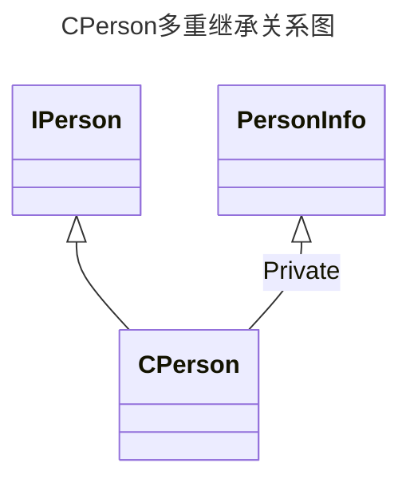

[TOC]

# 条款32：确定你的public继承塑模出is-a关系（Make sure public inheritance models “is-a”）

本条款内容比较简单，略写

## public继承的含义

**public继承意味着“is-a”的关系**

如果一个类D（derived）public继承自类B（base）：

- 每个类型D的对象也是一个类型B的对象，反之则不然
- B比D表示了一个更为一般的概念，而D比B表现了一个更为特殊的概念
- 任何可以使用类型B的地方，也能使用类型D；但可以使用类型D的地方却不可以使用类型B
- D是B，B不是D

```cpp
class Person { ... };
class Student: public Person { ... };

void eat(const Person& p);  //任何人都可以吃
void study(const Student& s);  //只有学生才到校学习
Person p;  //p是人
Student s;  //s是学生
eat(p);  //没问题，p是人
eat(s);  //没问题，s是学生，学生也是人
study(s);        
study(p);  //错误!p不是个学生
```

## 设计良好的继承关系

考虑鸟和企鹅的关系：

```cpp
class Bird {
public:
	virtual void fly();  //鸟可以飞    
	...
};
class Penguin: public Bird {  //企鹅是一种鸟，但不会飞，故直接继承有问题
	...
};
```

编译时会报错的设计：

```cpp
class Bird {
	...  //未声明fly函数
}; 

class FlyingBird: public Bird {
public:
    virtual void fly();  //会飞的鸟类
};

class Penguin :public Bird {
	...  //企鹅不会飞，未声明fly函数
};

Penguin p;
p.fly();  //错误！
```

运行时会报错的设计：

```cpp
class Bird {
public:
    virtual void fly();
};
 
void error(const std::string& msg);
class Penguin :public Bird {
public:
    virtual void fly() {
        error("Attempt to make a penguin fly!");
    }
};
```

**应优先选择在编译期间会报错的设计，而非在运行期间才报错的设计**

## is-a的例外

考虑矩形和正方形的关系:



```cpp
class Rectangle {
public:
    virtual void setHeight(int newHeight);  //高
    virtual void setWidth(int newWidth);  //宽 
    virtual void height()const;  //返回高
    virtual void width()const;  //返回宽
    ...
};

void makeBigger(Rectangle& r) //这个函数用来增加r的面积
{
    int oldHeight = r.height();  //取得旧高度
    r.setWidth(r.width() + 10);  //设置新宽度
    assert(r.height() == oldHeight);  //永远为真，因为高度未改变
}

class Square :public Rectangle { ... };
Square s;  //正方形类
...
assert(s.width() == s.height());  //永远为真，因为正方形的宽和高相同
makeBigger(s);  //由于继承，可以增加正方形的面积
assert(s.width() == s.height());  //对所有正方形来说，理应还是为真
```

上述代码会遇到问题：

1. 在调用makeBigger之前，s的高度和宽度是相同
2. 在makeBigger里面，s的宽度被改变了，但是高度不变
3. 再次调用assert理应还是返回真，因为此处的s为正方形

上例说明：

- 作用于基类的代码，使用派生类也可以执行。
- 但某些施行于矩形类中的代码，在正方形中却不可以实施
- is-a并非是唯一存在于classes之间的关系。
    - 另两个常见的关系是has-a（有一个）和is-implemented-terms-of（根据某物实现出）
    - 把这些相互关系的塑造为is-a会造成错误设计

**Tips：**

- public继承意味着is-a，适用于基类每一件事情一定也适用于派生类，因为每一个派生类对象也都是一个基类对象

# 条款33：避免遮掩继承而来的名称（Avoid hiding inherited names）

## 作用域的隐藏

编译器会先在局部作用域内查找名称，没查到再找其他作用域

```cpp
int x;  //全局变量
 
void someFunc()
{
    double x;  //局部变量
    std::cin >> x;  //局部变量赋值
}

```

当全局和局部存在同名变量时，在局部作用域中，优先使用局部变量，全局变量会被隐藏



C++的名称遮掩规则（name-hiding rules）只遮掩名称，无论名称否是同一类型。

## **继承的隐藏**

在继承中唯一关心的是成员变量和成员函数的名称，其类型没有影响：

```cpp
class Base
{
private:
    int x;
public:
    virtual void mf1() = 0;
    virtual void mf2();
    void mf3();
    ...
};
 
class Derived :public Base
{
public:
    virtual void mf1();  //重写(覆盖)
    void mf4();
    ...
};

//假设派生类中的mf4定义如下
void Derived::mf4()
void Derived::mf4()
{
	...
	mf2();
	...
}
```



在派生类的fm4()函数中调用了fm2函数，对于fm2函数的查找顺序如下：

1. 在fm4函数中查找，若没有进行下一步
2. 在派生类类中查找，若没有进行下一步
3. 在基类Base中查找，若没有进行下一步
4. 在Base所在的namespace中查找，若没有进行下一步
5. 在全局作用域查找

在派生类中重载mf3：

```cpp
class Base
{
private:
    int x;
public:
    virtual void mf1() = 0;
    virtual void mf1(int);
    virtual void mf2();
    void mf3();
    void mf3(double);
    ...
};
 
class Derived :public Base
{
public:
    virtual void mf1();  //基类中的所有mf1()都被隐藏
    void mf3();  //基类中的所有fm3()都被隐藏
    void mf4();
    ...
};

//调用如下
Derived d;
int x;
... 
d.mf1();  //正确
d.mf1(x);  //错误!被隐藏了
d.mf2();  //正确
d.mf3();  //正确
d.mf3(x);  //错误!被隐藏了
```



## 继承重载的函数

- **通过using声明式**

```cpp
class Base
{
private:
    int x;
public:
    virtual void mf1() = 0;
    virtual void mf1(int);
    virtual void mf2();
    void mf3();
    void mf3(double);
    ...
};
 
class Derived :public Base
{
public:
    using Base::mf1;  //Base所有版本的mf1函数在派生类作用域都可见
    using Base::mf3;  //Base所有版本的mf3函数在派生类作用域都可见
    virtual void mf1();  //重写mf1()函数
    void mf3();  //隐藏了mf1()，但是mf3(double)没有隐藏
    void mf4();
    ...
};

//调用如下
Derived d;
int x; 
d.mf1();  //正确，调用Derived::mf1
d.mf1(x);  //正确，调用Base::mf1
d.mf2();  //正确，调用Derived::mf2
d.mf3();  //正确，调用Derived::mf3
d.mf3(x);  //正确，调用Base::mf3
```

- **使用转交函数（forwarding function）**

```cpp
class Base {
public:
	virtual void mf1() = 0;
	virtual void mf1(int);
	...
};
class Derived: private Base {
public:
	virtual void mf1()  //转交函数
	{ Base::mf1(); }  //暗自成为inline
	...
}; 
...
//调用如下
Derived d;
int x;
d.mf1();  //正确，调用Derived::mf1
d.mf1(x);  //错误! Base::mf1()被覆盖了

```

**Tips：**

- 派生类内的名称会覆盖基类内的名称，在public继承中不应如此
- 可使用using声明式或转交函数来继承被覆盖的名称

# 条款34：区分接口继承和实现继承（Differentiate between inheritance of interface and inheritance of implementation）

public继承由两部分组成：**函数接口（function interface）**继承和**函数实现（function implementation）**继承

对于基类的成员函数可以大致做下面三种方式的处理：

- 纯虚函数：只继承成员函数的接口（也就是声明），让派生类去实现
- 虚函数：同时继承函数的接口和实现，也能覆写（override）所继承的实现
- 普通函数：同时继承函数的接口和实现，且不允许覆写

以表示几何图形的类为例：

```cpp
class Shape {
public:
	virtual void draw() const = 0;
	virtual void error(const std::string& msg);
	int objectID() const;
	...
};
class Rectangle: public Shape { ... };
class Ellipse: public Shape { ... };
```

**成员函数的接口总是会被继承**：

- public继承Shape类意味着对其合法的事一定对派生类合法

## 纯虚函数

纯虚函数具有两个突出特性：

- 继承它们的具象类必须重新声明
- 在抽象类中无定义

**声明一个纯虚函数的目的是为了让派生类只继承函数接口**：

- Shape类需要能够画出，~但不同形状的画法不同，故只留出通用接口而不提供具体实现

```cpp
Shape *ps = new Shape;  //错误!Shape是抽象的
Shape *ps1 = new Rectangle;  // 没问题
ps1->draw();  // 调用Rectangle::draw
Shape *ps2 = new Ellipse;  // 没问题
ps2->draw();  // 调用Ellipse::draw
ps1->Shape::draw();  // 调用Shape::draw
ps2->Shape::draw();  // 调用Shape::draw
```

## 虚函数

**声明简朴的impure virtual 函数的目的，是让派生类继承该函数的接口和缺省实现**：

- Shape类继承体系中必须支持遇到错误可调用的函数，但处理错误的方式可由派生类定义，也可直接使用Shape类提供的缺省版本

**若派生类忘记覆写这类函数，则会直接调用基类的实现版本**，这可能会导致严重问题，解决方案如下：

- 将默认实现分离成单独函数
    - 可能因过度雷同的函数名称而污染类命名空间
- 利用纯虚函数提供默认实现

```cpp
//将默认实现分离成单独函数
class Airplane {
public:
    virtual void fly(const Airport& destination) = 0;
    ...
protected:
    void defaultFly(const Airport& destination);
};
void Airplane::defaultFly(const Airport& destination) {
	//飞机飞往指定的目的地（默认行为）
}

class ModelA :public Airplane {
public:
    virtual void fly(const Airport& destination) {
        defaultFly(destination);
    }
    ...
};
//ModelB同ModelA

class ModelC :public Airplane {
public:
    virtual void fly(const Airport& destination);
};

void ModelC::fly(const Airport& destination) {
	//将C型飞机飞至指定的目的地
}
```

```cpp
//利用纯虚函数提供默认实现
class Airplane {
public:
    virtual void fly(const Airport& destination) = 0;
    ...
};
void Airplane::fly(const Airport& destination) {
	//缺省（默认）行为，将飞机飞至指定的目的地
}

class ModelA :public Airplane {
public:
    virtual void fly(const Airport& destination) {
        Airplane::fly(destination);
    }
    ...
};
//ModelB同ModelA
 
class ModelC :public Airplane {
public:
    virtual void fly(const Airport& destination);
};
void ModelC::fly(const Airport& destination) {
	//将C型飞机飞到指定目的地
}
```

## 普通函数

**声明non-virtual函数的目的是令派生类继承函数的接口以及一份强制性实现**：

- 意味是它并不打算在派生类中有不同的行为
- 其不变形（invariant）凌驾特异性（specialization）

**Tips：**

- 接口继承和实现继承不同。在public继承下，派生类总是继承基类的接口
- 纯虚函数只具体指定接口继承
- 简朴的虚函数具体指定接口继承以及缺省实现继承
- non-virtual函数具体指定接口继承以及强制性实现继承.

# 条款35：考虑virtual函数以外的其他选择（Consider alternatives to virtual functions）

以游戏角色为例：

```cpp
class GameCharacter {
public:
    virtual int healthValue() const;  //返回人物的健康指数，派生类可覆写
    ...
};
```

## **藉由Non-Virtual Interface手法实现Template Method模式**

考虑所有虚函数应几乎总是private的主张：

```cpp
class GameCharacter {
public:
    int healthValue() const {   //派生类不应该重新定义它
        ...  //事前工作，详下              
        int retVal = doHealthValue();  //真正的工作
        ...  //事后工作，详下                
        return retVal;
    }
private:
    virtual int doHealthValue() const  //派生类可以重新定义它
    {
    	...  //缺省，计算健康指数
    }
};
```

**NVI（non-virtual interface）手法**：

- 通过public non-virtual成员函数间接调用private virtual函数
- 是[**Template Method设计模式**](https://blog.csdn.net/natrick/article/details/112846765)（和C++ templates无关）的独特表现形式
- non-virtual函数称为virtual函数的**外覆器（wrapper）**
    - 外覆器使得在non-virtual函数中能做准备和善后工作：
        - 事前工作：锁定互斥器、制造运转日志记录项（log entry）、验证类约束条件、验证函数先决条件等等
        - 事后工作：互斥器解锁、验证函数的事后条件、再次验证类约束条件等等
- 会在派生类中重新定义private虚函数——重新定义它们不调用的函数
    - 派生类重新定义虚函数可控制如何实现功能
    - 基类保留函数何时被调用的权利
- 没有规定虚函数必须是private
    - 某些类继承体系要求派生类在虚函数的实现中必须调用其基类的对应部分，则虚函数必须是protected而非private，否则此类调用不合法
    - 有时虚函数必须是public的（如多态基类中的析构函数）,但是此时没法使用NVI手法

## **藉由Function Pointers实现Strategy模式**

**NVI没有免去定义虚函数**

考虑每个人物的构造函数接受一个指向健康计算函数的指针：

```cpp
class GameCharacter;	// 前置声明*forward declaration）
int defaultHealthCala(const GameCharacter& gc);  //计算健康指数的缺省算法
class GameCharacter {
public:
  typedef int(*HealthCalcFunc)(const GameCharacter& gc);  //函数指针别名
  explicit GameCharacter(HealthCalaFunc hcf = defaultHealthCalc) 
    : healthFunc(hcf) 
  {}    
  int healthValue() 
  { return healthFunc(*this); }  //通过函数指针调用函数
  ...
private:
	HealthCalcFunc healthFunc;  //函数指针
};
```

这个做法是常见的[**Strategy设计模式**](https://blog.csdn.net/natrick/article/details/113174673)的简单应用，其相对于继承体系内的虚函数具有一些弹性：

- 同一个人物类型之间可以有不同的健康计算函数
- 某已知人物的健康函数可在运行期变更

```cpp
//同一个人物类型之间可以有不同的健康计算函数
class EvilBadGuy: public GameCharacter {
public: 
	explicit EvilBadGuy(HealthCalaFunc hcf = defaultHealthCalc)
	  : GameCharacter(hcf) 
  { ... }
	...
};
 
int loseHealthQuickly(const GameCharacter&);  //健康指数计算函数1
int loseHealthSlowly(const GameCharacter&);  //健康指数计算函数2

EvilBadGuy ebg1(loseHealthQuickly);  //相同类型的人物搭配
EvilBadGuy ebg2(loseHealthSlowly);  //不同的健康计算方式
```

上述方法的应用范围：

- 当全局函数可以根据类的public接口来取得信息并且加以计算，则没有问题
- 若计算需要访问到类的non-public信息，则全局函数不可使用
    - 唯一的解决方法：**弱化类的封装**。例如：
        - 将这个全局函数定义为类的friend
        - 为其某一部分提供public访问函数

## **藉由Function Pointers实现Strategy模式**

若使用tr1::funciton对象替换函数指针用，则约束会大大减少：

> 这些对象可以持有任何可调用实体（callable entity，即函数指针、函数对象、成员函数指针），只要其签名式和需求兼容
> 

```cpp
class GameCharacter;  //如前
int defaultHealthCala(const GameCharacter& gc);  //如前
class GameCharacter {
public:
    //只是将函数指针改为了function模板，其接受一个const GameCharacter&参数，并返回int
    typedef std::tr1::function<int(const GameCharacter&)> HealthCalcFunc;	
    explicit GameCharacter(HealthCalcFunc hcf = defaultHealthCalc) 
	    : healthFunc(hcf) 
    {}
    int healthValue() const
    { return healthFunc(*this); }
    ...
private:
    HealthCalcFunc healthFunc;
};
```

上述代码中HealthCalFunc具有如下性质：

- 是对一个实例化的tr1::function的typedef
    - 其行为像一个泛化函数指针类型
- tr1::function实例的目标签名（target signature）表明：
    - 函数接受一个指向const GameCharacter的引用
    - 返回一个int类型
- 该tr1::function类型的对象可以持有任何同这个目标签名相兼容的可调用物，兼容的含义为：
    - 可调用物的参数要么是const GameCharacter&，要么可隐式转换成这个类型
    - 其返回值要么是int，要么可以隐式转换成int

上述设计和上一个GameCharacter持有一个函数指针的设计基本相同，唯一的不同是GameCharacter现在持有一个tr1::function对象——一个指向函数的泛化指针。从而使客户现在在指定健康计算函数上有了更大的弹性：

```cpp
short calcHealth(const GameCharacter&);  //计算健康指数的函数

struct HealthCalculator {  //计算健康指数的函数对象
    int operator()(const GameCharacter&)const {}
};
class GameLevel {
public:
    float health(const GameCharacter&) const;  //成员函数，用以计算健康
    ...
};

//人物1，使用函数来计算健康指数
EvilBadGuy ebg1(calcHealth);

//人物2，使用函数对象来计算健康指数
EyeCandyCharacter ecc1(HealthCalculator());

//人物2，使用GameLevel类的成员函数来计算健康指数
GameLevel currentLevel;
...
EvilBadGuy ebg2(std::tr1::bind(&GameLevel::health, currentLevel, _1));
```

## **古典的Strategy模式**

古典的Strategy做法会将计算健康的函数设计为一个分离的继承体系中的virtual成员函数：



代码如下：

> 该方案可让熟悉Strategy模式的人容易辨认，且可纳入既有的健康算法
> 

```cpp
class GameCharacter;  //前置声明
class HealthCalcFunc {  //计算健康指数的类
public:
    virtual int calc(const GameCharacter& gc)const {}
};
 
HealthCalcFunc defaultHealthCalc;
 
class GameCharacter {
public:
		//具有弹性，它为现存的健康计算算法的调整提供了可能性
    explicit GameCharacter(HealthCalcFunc* hcf = &defaultHealthCalc)  
	    : pHealthCalc(hcf) 
	  {}
    int healthValue() const 
    { return pHealthCalc->calc(*this); }
private:
    HealthCalcFunc* pHealthCalc;
};
```

## 摘要

虚函数的替换方案包括：

- 使用non-virtual interface（NVI）手法
    - 是Template Method设计模式的一种特殊形式
    - 以public non-virtual成员函数包裹较低访问性（private或protected）的virtual函数
- 将virtual函数替换为函数指针成员变量
    - 是Strategy设计模式的一种分解表现形式。
- 以tr1::function成员变量替换virtual函数
    - 允许使用任何可调用物搭配一个兼容于需求的签名式
    - 是Strategy设计模式的某种形式
- 将继承体系内的virtual函数替换为另一个继承体系内的virtual函数
    - 是Strategy设计模式的传统实现手法

**Tips：**

- 虚函数的替代方案包括NVI手法及Strategy设计模式的多种形式，NVI手法自身是一个特殊形式的Template Method设计模式
- 将功能从成员函数移到类外部函数会使得非成员函数无法访问类的non-public成员
- tr1::function对象的行为就像一般函数指针，其可接纳与给定的目标签名式（target signature）兼容的所有可调用物（callable entities）

# 条款36：绝不重新定义继承而来的non-virtual函数（Never redefine an inherited non-virtual function）

考虑D类由B类以public形式派生，且B类定义有一个public成员函数：

```cpp
class B {
public:
	void mf();
	...
};
class D: public B { ... }
```

以下两种行为存在不同：

```cpp
D x;  //x是一个类型为D的对象
B *pB = &x;                               
pB->mf();  //通过B*调用mf                      
D *pD = &x;                              
pD->mf();  //通过D*调用mf    
```

更具体地说，若mf是non-virtual并且D定义了自己的mf版本，上面的行为会明显不一样：

```cpp
class D: public B {
public:
	void mf();         
	...                     
};
pB->mf();  //调用B::mf
pD->mf();  //调用D::mf
```

造成差异的原因：

- non-virtual函数都是**静态绑定的（statically bound）**
    - pB被声明为指向B的指针，通过pB触发的non-virtual函数都会是定义在类B上的函数，即使pB指向的是B的派生类对象
- virtual函数是**动态绑定的（dynamically bound）**
    - 若mf是一个虚函数，无论通过pB或者pD对mf进行调用都会触发D::mf，因为pB或者pD真正指向的是类型D的对象。
- 引用也会有相同的问题

理论层面的理由：

- 条款32解释了pulibc继承意味着is-a（是一种）的关系
    - 适用于B对象的每一件事都适用于D对象，因为每一个D对象都是一个B对象
        - 若D覆写了mf，则is-a关系不成了，那么D不应该以public形式继承B
- 条款34描述了为什么在一个类中声明一个non-virtual函数，则其不变性（invariant）凌驾于特异性（specialization）
    - B的派生类一定会继承mf的接口和实现，因为mf是B的non-virtual函数
        - 若D需要以public继承B且覆写了mf，则不变性就没有凌驾于特异性，那么mf应该声明为虚函数（如析构函数）
- 综上所述，禁止重新定义一个继承而来的non-virtual函数

**Tips：**

- 绝对不要重新定义继承而来的non-virtual函数

# 条款37：绝不重新定义继承而来的缺省参数值（Never redefine a function’s inherited default parameter value）

## **虚函数和缺省参数值**

**虚函数是动态绑定，而缺省参数值是静态绑定的**

- 静态绑定，又名前期绑定（early binding）
- 动态绑定，又名后期绑定（late binding）

```cpp
//一个用以描述几何形状的类
class Shape {
public:
	enum ShapeColor { Red, Green, Blue };
	//所有形状都必须提供一个函数，用来绘出自己
	virtual void draw(ShapeColor color = Red) const = 0;
	...
};

class Rectangle: public Shape {
public:
	//赋予不同的缺省参数值，不好！
	virtual void draw(ShapeColor color = Green) const;
	...
};
class Circle: public Shape {
public:
	virtual void draw(ShapeColor color) const;
	//注意，以上这么写则当客户以对象调用此函数，一定要指定参数值
	//因为静态绑定下这个函数并不从其base继承缺省参数值
	//但若以指针（或引用）调用此函数，可以不指定参数值
	//因为动态绑定下这个函数会从其基类继承缺省参数值
	...
};
```



考虑以下指针：

> 以下指针均声明为指向Shape的指针，故无论它们指向什么，静态类型都为Shape*；动态类型则是当前所指的对象的类型
> 

```cpp
Shape *ps;  //静态类型为Shape*，无动态类型，未指向任何对象                         
Shape *pc = new Circle;  //静态类型为Shape*，动态类型为Circle*             
Shape *pr = new Rectangle;  //静态类型为Shape*，动态类型为Rectangle* 
ps = pc;  //ps的动态类型变为Circle*
ps = pr;  //ps的动态类型变为Rectangle*  
pc->draw(Shape::Red);  //调用Circle::draw(Shape::Red)   
pr->draw(Shape::Red);  //调用Rectangle::draw(Shape::Red)        
pr->draw();  //调用Rectangle::draw(Shape::Red) !
```

- 虚函数是动态绑定的，故哪个函数被调用是由发出调用的对象的动态类型来决定的
- 虑函数带缺省参数值的虚函数时，默认参数是静态绑定的，则可能函数定义在派生类中却使用了基类中的默认参数

采用上述运行方式的原因和效率相关：

- 如果一个默认参数是动态绑定的，编译器必须在运行时为虚函数决定适当的参数缺省值
    - 这比起在编译期决定这些参数的机制更慢且更复杂

## 避免重复的缺省参数值

同时提供缺省参数值给基类和派生类会导致代码重复且具有相依性（with dependencies）：

```cpp
class Shape {
public:
	enum ShapeColor { Red, Green, Blue };
 	virtual void draw(ShapeColor color = Red) const = 0;
	...
};

class Rectangle: public Shape {
public:
	virtual void draw(ShapeColor color = Red) const;
	...
};

```

可使用NVI手法解决上述问题：

- 用基类中的public非虚函数调用一个private虚函数，private虚函数可以在派生类中重新被定义
- 用非虚函数指定默认参数，而用虚函数来做实际的工作

```cpp
class Shape {
public:
	enum ShapeColor { Red, Green, Blue };
	void draw(ShapeColor color = Red) const   
	{                                                                 
		doDraw(color);                           
	}                                                  
	...                                                 
private:                                       
	virtual void doDraw(ShapeColor color) const = 0; 
}; 
class Rectangle: public Shape {
public:
	...
private:
	virtual void doDraw(ShapeColor color) const; 
	...                                                               
};          
```

**Tips：**

- 绝对不要重新定义一个继承而来的缺省参数值，因为缺省参数值都是静态绑定，而唯一应该覆写的虚函数却是动态绑定。

# 条款38：通核复合塑模出has-a或“根据某物实现出”（Model “has-a” or “is-implemented-in-terms-of” through composition）

## 复合的含义

**复合（composition）**是类型之间的一种关系：

- 这种关系见于一种类型的对象包含另外一种类型的对象时
- 又称分层（layering）、包含（ containment）、聚合 （aggregation）、和植入（embedding）

```cpp
class Address { ... };  // 住址
class PhoneNumber { ... };
class Person {
	public:
	...
private:
	std::string name;  //合成成分物（composed object）
	Address address;  //同上
	PhoneNumber voiceNumber; 	//同上
	PhoneNumber faxNumber;  //同上
};   
```

复合根据软件中两种不同的领域（domain）有有两种含义：

- has-a：对象是应用域（application domain）的一部分
    - 对应世界上的真实存在的东西，如人、汽车、视频画面等
- is-implemented-in-terms-of（根据某物实现出）：对象是实现域（implementation domain）的一部分
    - 对应纯实现层面的人工制品，如像缓存区（buffers）、互斥器（mutexs）、查找树（search trees）等

## 区分不同的关系

区分is-a和has-a很简单；区分is-a和is-implemented-in-terms-of比较困难，过程见下：

1. 假设需要一个类模板表示由不重复对象组成的set
2. 首先考虑使用标准库的set模板以实现复用（reuse）
3. 不幸的是，set的实现对于其中的每个元素都会引入三个指针的开销
    1. set通常作为一个平衡查找树（balanced search trees）来实现，以保证查找、插入、删除元素时具有对数时间（logarithmic-time）效率
    2. 当速度比空间重要时，此设计合理
    3. 当空间比速度重要时，此设计不合理，需要自己实现模板
4. 考虑利用C++标准库中的list template以在底层使用linked lists，从而实现sets
    1. 此方法会让Set template继承std::list，即Set<T>继承list<T>
    2. 但是，list对象可以包含重复元素而Set不可以，这违反了is-a关系，不应使用public继承

```cpp
template<typename T>   //把list用于Set。错误做法！               
class Set: public std::list<T> { ... };     
```

1. 正确的方式是Set对象可以被implemented in terms of为一个list对象
    1. Set成员函数的实现可以依赖list已经提供的功能和标准库的其他部分，以简化实现

```cpp
template<class T>  //把list用于Set。正确做法                         
class Set {                                        
public:                                            
	bool member(const T& item) const; 
	void insert(const T& item);            
	void remove(const T& item);         
	std::size_t size() const;                   
private:                                          
	std::list<T> rep;  //用以表述Set的数据            
};   
//依赖list已经提供的功能和标准库的其他部分实现Set的成员函数
template<typename T>
bool Set<T>::member(const T& item) const
{
	return std::find(rep.begin(), rep.end(), item) != rep.end();
}
template<typename T>
void Set<T>::insert(const T& item)
{
	if (!member(item)) rep.push_back(item);
}
template<typename T>
void Set<T>::remove(const T& item)
{
	typename std::list<T>::iterator it = //见条款42对
	std::find(rep.begin(), rep.end(), item); //typename的讨论
	if (it != rep.end()) rep.erase(it);
}
template<typename T>
std::size_t Set<T>::size() const
{
	return rep.size();
}
```

1. 以上过程展示了is-implemented-in-terms-of而非is-a的关系

**Tips：**

- 复合的意义和public继承完全不同
- 在应用域，复合意为has-a（有一个）；在实现域，复合意味着is-implemented-in-terms-of（根据某物实现出）

# 条款39：明智而审慎地使用private继承（Use private inheritance judiciously）

## private继承

考虑private继承的例子：

```cpp
class Person { ... };
class Student: private Person { ... };  //改用private继承
void eat(const Person& p);  //任何人都可以吃
void study(const Student& s);  //只有学生才在校学习
Person p;  //p是人
Student s;  //s是学生
eat(p);  //正确，p是人
eat(s);  //错误! 
```

private继承的规则：

- 类之间为private继承时，编译器不会将派生类对象（Student）转换成为基类对象（Person）
    - 因此对象s调用eat会失败
- 由基类private继承而来的所有成员（包括protected和public成员），在派生类中都会变成private属性

private继承的意义：

- private继承意味着is-implemented-in-terms-of（根据某物实现出）
    - 如果你让类D private继承自类B，你的用意是因为你想利用类B中的一些让你感兴趣的性质，而不是因为在类型B和类型D之前有任何概念上的关系
- private继承纯粹只是一种实现技术
    - 因此从private基类中继承而来的任何东西在派生类中都变为了private
        - 所有东西只被继承了的实现部分
- private继承意味着只有实现部分被继承，而接口应略去
    - 如果类D是private继承自类B，就意味着D对象的实现依赖于类B对象，没有其他含义
- private继承在软件实现层面才有意义，在软件设计层面没有意义

## private继承和复合

**尽量使用复合（composition），必要时才使用private继承**：

- 要访问基类的protected成员或要重定义基类的虚函数时
- 需要追求极致的空间时

考虑Widget类，需要了解：

- 成员函数的使用频率
- 调用比例如何变化
    - 带有多个执行阶段（execution phases）的程序，可能在不同阶段拥有不同的行为轮廓（behavioral profiles）
        - 例如编译器在解析（parsing）阶段所用的函数不同于在最优化（optimization）和代码生成（code generation）阶段所用的函数

因此需要设定定时器以提醒统计调用次数的时机：

```cpp
class Timer {
public:
	explicit Timer(int tickFrequency);
	virtual void onTick() const; //定时器每滴答一次
	...  //此函数就自动调用一次
};      
```

Widget必须继承自Timer以重定义Timer内的虚函数：

- Widget不是一个Timer，故public继承不合适
- 可使用private继承，但非必要
- 可使用复合，且应选择复合
    - 防止Widget的派生类重写onTick函数
        - Widget的派生类无法访问作为private成员的WidgetTimer类，则无法重写onTick
    - 可以将Widget的编译依存性降至最低
        - 使用private继承必须#include "Timer.h”
        - 使用复合则可以无需#include任何与Timer有关的东西
            - 若将WidgetTimer定义在Widget之外，然后在Widget内定义一个WidgetTimer的指针，此时Widget可以只带着WidgetTimer的声明式

```cpp
//private继承
class Widget: private Timer {
private:
	virtual void onTick() const; 
	...                                           
}   

//复合
class Widget{
private:
    class WidgetTimer :public Timer {
    public:
        virtual void onTick()const;
        ...
    };
    WidgetTimer timer;
    ...
};
```



## 激进的情况

只适用在没有数据的类中，这种类：

- 没有非静态数据成员
- 没有虚函数（因为虚函数的存在会为每个对象添加一个vptr指针，见条款7）
- 没有虚基类（因为这样的基类同样会引入额外开销，见条款40）
- 从概念上来说，这样没有数据需要保存的空类对象应该不使用空间，然而由于技术的原因，C++使得独立对象必须占用空间

```cpp
class Empty {};  //没有数据，应该不使用任何内存
 
class HoldsAnint {  //应该只需要一个int空间
private:
    int x;
    Empty e;  //应该不需要任何内存
};
```

上述代码中：

- sizeof(HoldsAnInt)>sizeof(int)，一个Empty数据成员也会占用空间
- 对于大多数编译器来说，sizeof(Empty)为1
    - 因为C++法则处理大小为0的独立对象时会默认向空对象中插入一个char
        - 不能被应用在派生类对象的基类部分中，因为它们不是独立的
- 齐位需求（alignment，见条款50）可能导致编译器向HoldsASnInt这样的类中添加衬垫（padding）
    - HoldsAnInt对象可能不只获得一个char的大小，实际上会被增大到可容纳第二个int

若继承Empty则其非独立，其大小可以为0：

> 由于**EBO（empty base optimization，空白基类最优化）**，几乎可以确定sizeof(HoldsAnInt)==sizeof(int)。EBO一般在单一继承而非多重继承下才可行
> 

```cpp
class HoldsAnInt: private Empty {
private:
	int x;
};
```

事实上，空类不是真的空：

- 虽然它们永远不会拥有非静态数据成员，它们通常会包含typedefs、enums、静态数据成员或non-virtual非虚函数
    - STL就包含很多技术用途的空类，其中包含有用的成员（通常为typedefs）的空类
        - 包括基类unary_function和binary_function，用户定义的函数对象会继承这些类
        - EBO使得这些继承很少会增加派生类的大小

**Tips：**

- private继承意为is-implemented-in-terms-of（根据某物实现出），通常优先使用而非private继承，但是当派生类需要访问protected基类成员或需要重新定义虚函数时可以使用
- 和复合不同，private继承可以使空基类最优化，有利于对象尺寸最小化

# 条款40：明智而审慎地使用多重继承（Use multiple inheritance judiciously）

本条款主要讨论两种观点：

- 单一继承（single inheritance，SI）是好的，多重继承（multiple inheritance，MI）会更好
- 单一继承是好的，但多重继承不值得拥有

## **接口调用的歧义性**

以下例子具有歧义（ambiguity）：

```cpp
class BorrowableItem {  //图书馆允你借某些东西
public:                    
	void checkOut();  //离开进行检查
  ...                                       
};                                       
class ElectronicGadget {    
private:                             
	bool checkOut() const;  //注意，此处的为private 
	... 
};
class MP3Player:  //多重继承
	public BorrowableItem,
	public ElectronicGadget 
{ ... };              
MP3Player mp;
mp.checkOut();  //歧义！调用的是哪个checkOut?
```

对checkout的调用是歧义的：

- 即使只有两个函数中的一个是可取用的（checkout在BorrowableItem中是public的而在ElectronicGadget中是private的），歧义仍然存在
- 这与C++用来解析（resolving）重载函数调用的规则相符：
    - 在看到是否有个函数可取用之前，C++首先识别出对此调用而言的最佳匹配函数
    - 找到最佳匹配函数之后才会检查函数的可取用性
    - 本例的两个checkOut具有相同的匹配程度（所以造成歧义），没有最佳匹配，因此ElectronicGadget::checkOut的可取用性未被编译器审查
- 为了解决这个歧义，必须指定调用哪个基类的函数

```cpp
mp.BorrowableItem::checkOut();   
```

## **菱形继承与虚(virtual)继承**

多重继承意味着继承多个基类，但是这些基类在继承体系往往没有更高层次的基类，否则会导致致命的”钻石型多重继承”：

```cpp
class File { ... };
class InputFile: public File { ... };
class OutputFile: public File { ... };
class IOFile: public InputFile, public OutputFile
{ ... };

```



如果基类和派生类之间有一条以上的相通路线，则必须面对基类中的数据成员是否在每条路径上都要被复制的问题：

- 假设File类有一个数据成员，fileName
- IOFile应该有它的几份拷贝？
    - 方案一：它从每个基类中都继承了一份拷贝，所以IOFile应该会有两个fileName数据成员
    - 方案二：一个IOFIle只有一个文件名，所以从两个基类中继承的fileName部分不应该重复
    - C++对两个方案都支持，但缺省做法是执行复制（方案一）

**如果想执行方案二，则必须使包含数据（即File）的类成为虚基类，即虚继承它**：

> C++标准库程序内含一个类模版的多重继承体系，包含basic_ios、basic_istream、basic_ostream、basic_iostream
> 

```cpp
class File { ... };
class InputFile: virtual public File { ... };
class OutputFile: virtual public File { ... };
class IOFile: public InputFile, public OutputFile
{ ... };
```



虚继承的代价：

- 虚继承耗费资源
    - 使用虚继承的类创建出来的对象会比不使用虚继承的类创建出来的对象要大
    - 访问虚基类中的数据成员比访问非虚基类中的数据成员要慢
- 支配虚基类初始化列表的规则比非虚基类更加复杂，且不直观
    - 初始化虚基类部分的责任由继承体系中最底层的派生类（most derived class）承担，则：
        - 继承自虚基类的类如果需要初始化，它们必须意识到虚基类的存在，无论这个虚基类离派生类有多远
        - 当一个派生类被添加到继承体系中的时候，它必须承担初始化虚基类的责任（无论是直接的还是间接的虚基类）。

使用虚继承（即虚基类）的建议：

- 不要使用虚基类，除非你需要它。默认情况下使用非虚基类。
- 若必须使用虚基类，尽可能避免在这些类中放置数据，从而避免古怪的初始化和赋值
    - Java和.NET中的接口在许多方面相当于C++的虚基类，且不允许包含任何数据的

## 多重继承举例

以表示人的C++接口类为例：

```cpp
class IPerson {
public:
	virtual ~IPerson();
	virtual std::string name() const = 0;  //返回人的名称
	virtual std::string birthDate() const = 0;  //返回生日
};
```

IPerson是抽象类：

- 无法实例化，则必须依赖IPerson指针和引用来编写程序
- 为了创建可以视为IPerson的对象，可使用工厂函数来实例化派生自IPerson的具象类

```cpp
//工厂函数，根据一个独一无二的数据库ID创建一个Person对象
std::tr1::shared_ptr<IPerson> makePerson(DatabaseID personIdentifier);
//该函数从使用者手上取得一个数据库ID
DatabaseID askUserForDatabaseID();
DatabaseID id(askUserForDatabaseID());
//创建一个支持IPerson接口的对象，由IPerson成员函数处理*pp
std::tr1::shared_ptr<IPerson> pp(makePerson(id)); 
...                                                                            
```

上述代码中，makePerson能创建对象并返回指向它的指针：

- 必有些派生自IPerson的具象类，使得makePerson能够对这些具现类进行实例化
- 假设该类为CPerson，它必须为继承自IPerson的纯虚函数提供一份实现代码
    - 可从头编写实现代码
    - 可方便地利用现成的组件，其实现了大部分甚至全部的必要功能
        - 假设一个旧数据库指定的类PersonInfo为CPerson提供了它需要的最基本的东西：

```cpp
class PersonInfo {
public:
	explicit PersonInfo(DatabaseID pid);
	virtual ~PersonInfo();
	virtual const char* theName() const;
	virtual const char* theBirthDate() const;
	...
private:
	virtual const char* valueDelimOpen() const; 
	virtual const char* valueDelimClose() const; 
	...
};
```

PersonInfo用以协助以各种格式打印数据库字段：

- 每个字段值的起始点和结束点以特殊字符串为界
- 缺省的头尾界限符号是方括号
    - 例如Ring-tailed Lemur将被格式化为[Ring-tailed Lemur]
- 两个virtual函数valueDelimOpen和valueDelimClose允许派生类自己定义的头尾界限符号
    - 以PersonInfo::theName为例：

```cpp
const char* valueDelimOpen()const
{
  return "[";  //缺省的起始符号
}
 
const char* valueDelimClose()const
{
  return "]";  //缺省的结尾符号
}
const char* theName()const {
	//保留缓冲区给返回值使用；由于缓冲区是static，因此会自动初始化为全0
  static char value[Max_Formatted_Field_Value_Length];
  std::strcpy(value, valueDelimOpen());  //写入起始符号
  //将value内的字符串添加到该对象的name成员变量中（须避免缓冲超限）
  std::strcat(value, valueDelimClose());  //写入结尾符号
  return value;
}
```

CPerson和PersonInfo之间的关系：

- PersonInfo恰好有一些函数使得CPerson的实现更加容易
    - 因此它们的关系为is-implemented-in-terms-of
- CPerson需要重新定义valueDelimOpen和valueDelimClose
    - 最简单的解决方案是让CPerson直接private继承PersonInfo（此处采用）
    - 也可让CPerson可以使用组合和继承的结合体来有效重定义PersonInfo的虚函数

CPerson同样必须实现IPerson接口，故需要使用public继承，则此时多重继承应用合理：**public继承现有接口结合private继承以重定义实现**

```cpp
class IPerson {  //这个类支出需要实现的接口
public:
  virtual ~IPerson();
  virtual std::string name() const = 0;
  virtual std::string birthDate() const = 0;
};
 
class DatabaseID { ... };
 
class PersonInfo {  //这个类由若干有用的函数可实现IPerson接口
public:
  explicit PersonInfo(DatabaseID pid);
  virtual ~PersonInfo();
  virtual const char* theName()const;
  virtual const char* theBirthDate()const;
  virtual const char* valueDelimOpen()const;
  virtual const char* valueDelimClose()const;
};
 
class CPerson :public IPerson, private PersonInfo {  //注意，多重继承
public:
  explicit CPerson(DatabaseID pid) :PersonInfo(pid) {}
  virtual std::string name() const  //实现必要的IPerson成员函数
  { return PersonInfo::theName(); }
  virtual std::string birthDate() const  //实现必要的IPerson成员函数
  { return PersonInfo::theBirthDate(); }
private:  //重定义继承来的virtual“界限函数”
  virtual const char* valueDelimOpen() const { return "" };
  virtual const char* valueDelimClose() const { return "" ;
};                                                               

```



**Tips：**

- 多重继承比单一继承复杂，它可能导致歧义以及对virtual继承的需求
- virtual继承会增加大小、速度、初始化、赋值的复杂度等等成本，其在virtual基类不带任何数据时最具使用价值
- 多重继承存在合适的应用，其中之一是两种情况的融合：public继承某个接口类和private继承某个协助实现的类